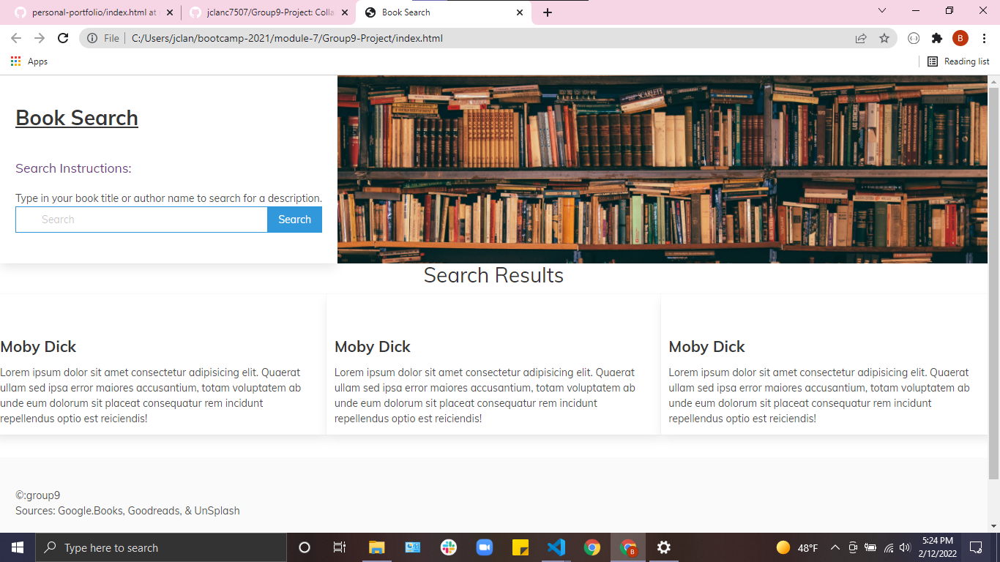

# Book Search Web App

## Description:
An effective web page application that allows the user search for book titles and descriptions and to save those books into a personal library through the use of Google Books and Goodreads.

## User Story
AS AN avid book reader
I WANT to search for book titles and create a reading list
SO THAT I can begin collecting these books for my own education or entertainment.

GIVEN a simple search bar that accepts author names or book titles,
WHEN I search for an author or book title
THEN I am presented with relevant search results listing out books of said title or books from said author.
WHEN I view the search results
THEN I can see the title, author, and a brief description of the book, divided into individual cards.

## Deployed Weblink:
https://jclanc7507.github.io/Group9-Project/

## Collaborator GitHub Links:
Danny - https://github.com/Danielyaj4
Evan - https://github.com/evanpauly
Kim - https://github.com/kimmy-hill
Jeremiah - https://github.com/jclanc7507

### Screenshot of Deployed Page:

### Wireframe:

### Sources:
Bulma - https://cdn.jsdelivr.net/npm/bulma@0.9.3/css/bulma.min.css
Google Books - 